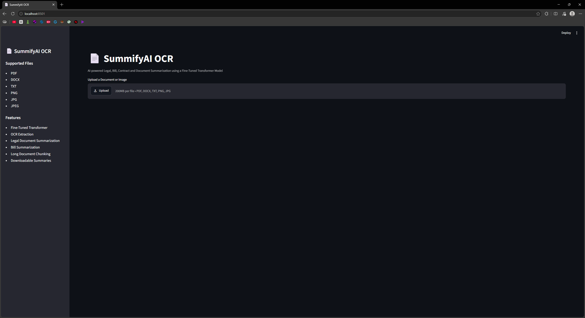
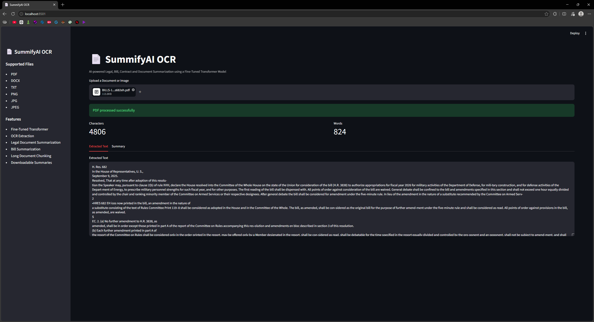
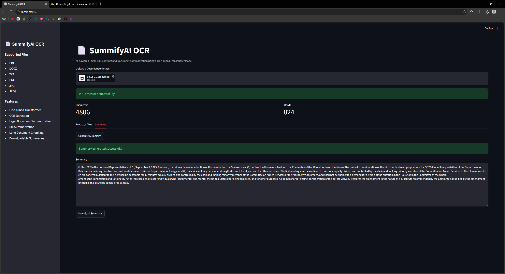

# 📄 SummifyAI OCR – Bill & Legal Document Summarizer

An AI-powered document summarization system that extracts text from legal documents, bills, contracts, PDFs, DOCX files, text files, and images, then generates concise summaries using a fine-tuned Transformer model.

The application combines Optical Character Recognition (OCR) with Natural Language Processing (NLP) to automate document understanding and reduce the time required to review lengthy legal content.

---

## Features

- Fine-tuned Transformer-based summarization model
- OCR support for scanned documents and images
- PDF document processing
- DOCX document processing
- TXT file processing
- Image text extraction using EasyOCR
- Automatic text chunking for long documents
- Download generated summaries
- Interactive Streamlit web application
- Hugging Face model integration

---

## Supported File Types

| File Type | Supported |
|------------|------------|
| PDF | ✅ |
| DOCX | ✅ |
| TXT | ✅ |
| PNG | ✅ |
| JPG | ✅ |
| JPEG | ✅ |

---

## Model Information

### SummifyAI

The application uses a custom fine-tuned Transformer model trained for bill and legal document summarization.

**Base Model**

- facebook/bart-large-cnn

**Fine-Tuned On**

- BillSum Dataset

**Task**

- Abstractive Text Summarization

**Specialization**

- Legal Documents
- Bills
- Legislations
- Contracts
- Policy Documents

---

## Workflow

```text
Document/Image Upload
          │
          ▼
Text Extraction
(PDF/DOCX/TXT/OCR)
          │
          ▼
Text Chunking
          │
          ▼
SummifyAI Transformer
          │
          ▼
Generated Summary
```

---

## Screenshots

### Upload Interface



### OCR & Text Extraction



### Generated Summary



---

## Project Architecture

```text
Bill-and-Legal-Doc-Summarizer/

├── app.py
├── requirements.txt
├── README.md
│
└── screenshots/
```

---

## Technologies Used

- Python
- Streamlit
- PyTorch
- Transformers
- Hugging Face
- EasyOCR
- PyPDF2
- pdfplumber
- python-docx
- NumPy
- Pillow

---

## Installation

Clone the repository:

```bash
git clone https://github.com/MeetNotFound/Bill-and-Legal-Doc-Summarizer.git
cd Bill-and-Legal-Doc-Summarizer
```

Install dependencies:

```bash
pip install -r requirements.txt
```

Run the application:

```bash
streamlit run app.py
```

---

## Hugging Face Model

The application loads the fine-tuned model directly from Hugging Face:

```python
MODEL_HF_REPO = "MeetNotFound/Bill-and-Legal-Doc-Summarizer"
```

---

## Future Improvements

- Multi-language OCR support
- Named Entity Recognition (NER)
- Legal clause extraction
- Key point highlighting
- Document comparison
- PDF export of generated summaries
- Explainable AI visualizations

---

## Live Demo

Try the application online:

https://bill-and-legal-doc-summarizer-k2pm59os5btultf3yt9xapp.streamlit.app/

---

## License

This repository is intended for educational, research, and portfolio demonstration purposes.

GitHub: https://github.com/MeetNotFound

LinkedIn: https://www.linkedin.com/in/meet-pawar
